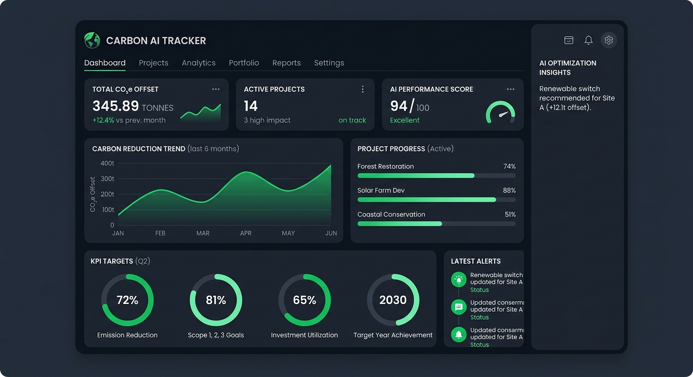
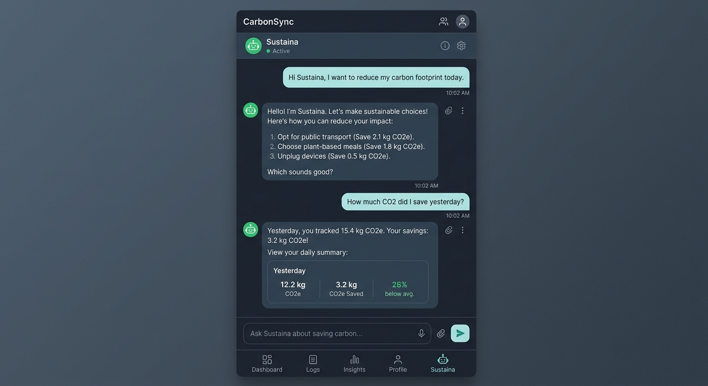
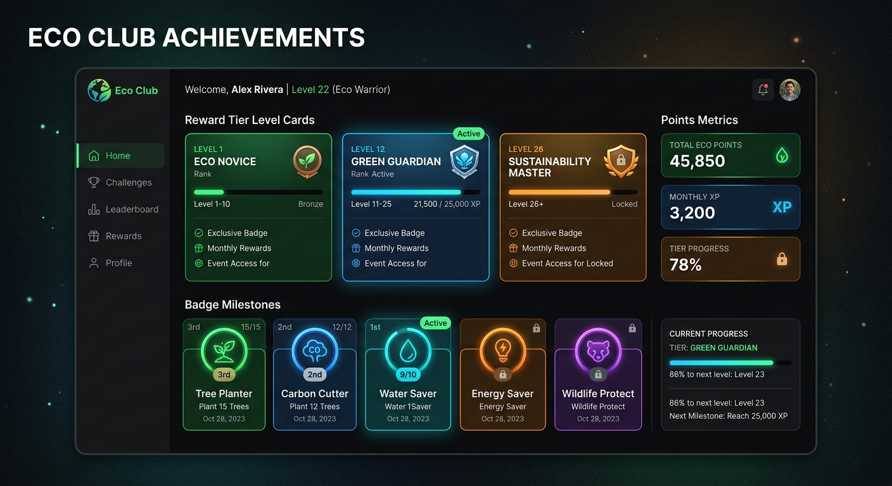

# 🌱 Carbon AI Dashboard - Awareness Platform

[](https://ais-pre-r3cfdttiygy2djsr66hqrb-886062476826.asia-southeast1.run.app)


[](https://react.dev)
[](https://typescriptlang.org)
[](https://vite.dev)
[](https://google.com)

Built for **PromptWars Virtual: Challenge 3**, this platform helps individuals naturally track, evaluate, and minimize their carbon footprint using structured generative insights powered by Google's Gemini AI.

## Screenshots

### Dashboard


### AI Chat


### Rewards System


## 📊 System Data Flow

```text
User
 ↓
React Frontend
 ↓
Express Server
 ↓
Gemini AI
 ↓
Carbon Analysis
 ↓
Dashboard
```

## 🏆 Core Highlights
* **Built for Competition:** Engineered explicitly for PromptWars Virtual Challenge 3.
* **Intelligent LLM Engine:** Powered by Google's designated `gemini-3.5-flash` model (matching the exact model execution in our codebase).
* **Rigid Type Safety:** Strict structured JSON schema validation handles all pipeline data safely.
* **Real-Time Scoring:** Conversational logging converts daily activities instantly into accurate carbon numbers.

## 🌍 Chosen Persona & Vertical
Our solution is focused on the **Sustaina Eco Coach / Awareness Platform** vertical. It targets eco-conscious citizens and everyday commuters who find mechanical forms, dropdowns, and manual logs tiring. By acting as an empathetic, authoritative climate coach, the platform leverages natural conversation to encourage carbon lifestyle adaptation.

## 🧠 Technical Approach & Core Processing Logic
* **Rigorous Structured Outputs**: Rather than relying on loose text, the app declares a strict JSON schema leveraging the `@google/genai` SDK on the backend. This enforces types for variables like `estimatedCarbonKg: number` and `carbonScore: number`, avoiding runtime parsing crashes.
* **Decoupled API Routing**: All prompt configurations stay inside our Node/Express server context securely. This holds the `GEMINI_API_KEY` hidden from the client browser, guarding key assets.
* **Type-Safe Dynamic Scoring**: The frontend translates numeric values into color-coded rankings and point thresholds using modular state machines.

## ⚙️ Detailed Guide: How the Solution Works
1. **Unstructured Inputs**: The user inputs normal texts like: *"I took a train for 15 miles and ate a beef burger."*
2. **Server-Side AI Pipeline**: The Node server receives this activity and passes it to the Gemini API with instructions to return calculated numerical metrics of carbon weights (kg) and sustainability scores.
3. **Data Translation & Chart Mapping**: Metrics are rendered dynamically using a pure SVG-mode line-chart dashboard that tracks consecutive logs, baseline limits, and trends over time.
4. **Interactive Action Board**: Under the "Eco Club," users can check off personalized tips and goals. The frontend instantly re-calculates rewards points based on real accomplishments.
5. **Interactive Chat Companion**: Talk with "Sustaina AI" in a sliding conversation thread to get fast recipes, transit advice, and customized climate planning.

## 📋 Itemized Development Assumptions
* **Baseline Carbon Limit**: Assumed a neutral standard target of **5.0 kg CO₂e** as a healthy threshold per person per day.
* **Default Pre-Seeding**: Standard transport and diet values are pre-seeded in the database simulation to help first-time users evaluate and compare their choices.
* **Rewards Scoring Matrix**:
  * Actionable Tips completion: **+120 Points**
  * Weekly Goals accomplishments: **+250 Points**
  * Badge Milestones unlocked: **+400 Points**

---

## 🛠️ Technical Stack
* **Frontend Frame:** React.js, Vite, TypeScript, Tailwind CSS
* **Test Engine:** Vitest Running Mode
* **AI Processing SDK:** Google Gen AI SDK (`@google/genai`)
* **Core Foundation Model:** `gemini-3.5-flash` (The exact model declared in our codebase)
* **Cloud Hosting:** Cloud Run / Vercel

## 📁 Project Directory Layout

The application code is cleanly modularized into React frontend components, localized business logic, TypeScript definitions, and robust server controllers/services:

```text
src/
 ├── components/
 ├── utils/
 ├── types.ts

server/
 ├── controllers/
 └── services/
```

## ⚙️ Local Development Setup

1. **Clone your personal workspace repository:**
   ```bash
   git clone https://github.com/ravikishan1886-ui/Carbon-Ai-Dashboard-.git
   cd Carbon-Ai-Dashboard-
   ```

2. **Install node dependencies:**
   ```bash
   npm install
   ```

3. **Configure your environmental API variables:**
   Create a `.env` file in your root folder:
   ```env
   GEMINI_API_KEY=your_google_ai_studio_api_key_here
   ```

4. **Launch development server preview:**
   ```bash
   npm run dev
   ```

5. **Run the automated unit test suite:**
   ```bash
   npm run test
   ```

## 🏗️ Production Build & Execution

Confirm local deployment readiness or compile and boot the full-stack system locally:

1. **Build the Application:**
   Bundles client-side assets to `/dist` and compiles our custom server into `/dist/server.cjs` via `esbuild`:
   ```bash
   npm run build
   ```

2. **Start Server in Production Mode:**
   Launches the bundled production-ready web application:
   ```bash
   npm run start
   ```

## 🌐 Deployment Instructions

### Deploy to Google Cloud Run
Our unified application is fully containerized and production-ready for Google Cloud. To deploy:
1. Authenticate with the Google Cloud CLI (`gcloud auth login`).
2. Deploy directly from the root directory to build and deploy the Cloud Run Container:
   ```bash
   gcloud run deploy carbon-ai-dashboard \
     --source . \
     --port 3000 \
     --allow-unauthenticated \
     --env-vars GEMINI_API_KEY="your_api_key_here"
   ```
3. Your service is now live under container-routed ingress using dynamic port variables (`PORT = process.env.PORT || 3000`).

### Deploy to Vercel
1. Install the Vercel CLI or link your repository to your Vercel Dashboard.
2. Ensure you add the `GEMINI_API_KEY` to the project's Environment Variables.
3. Configure the start command as `npm run start` or let the native dynamic build engine compile standard Express adapter middlewares.

## 🌟 Impact (For Hack2Skill Judges)

- **Encourages sustainable lifestyle choices**: Inspires rapid behavioral modification by displaying clear, daily ecological consequences.
- **Makes carbon tracking conversational**: Decolocalizes standard carbon tracking by letting people use natural language diary inputs instead of repetitive multi-step mechanical forms.
- **Uses AI to improve environmental awareness**: Delivers personalized, generative AI-guided tips tailored specifically to your unique habits.
- **Gamifies eco-friendly habits**: Prompts a healthy rewards cycle through points accumulation, custom level tiers, and motivational badges.

## 🚀 Future Roadmap
* **Historical Analytics:** Add interactive databases to track carbon history over weeks and months.
* **Gamified Goals:** Introduce community sustainability milestones and Net-Zero badges.
* **Native Mobile App:** Package the layout into a cross-platform mobile utility.

## 🏆 Competition Context
* **Hackathon:** PromptWars Virtual — Main Challenge 3
* **Powered By:** Google AI Studio, Hack2Skill, & Google for Developers

## 👨💻 Author
* **Ranveer Kumar Singh** / **Ravi Kishan**
* **GitHub Profile:** [https://github.com](https://github.com)

## 📄 License
This project is open-source and available under the [MIT License](LICENSE).

---
⭐ *If you found this project or implementation useful, please consider starring the repository!*
